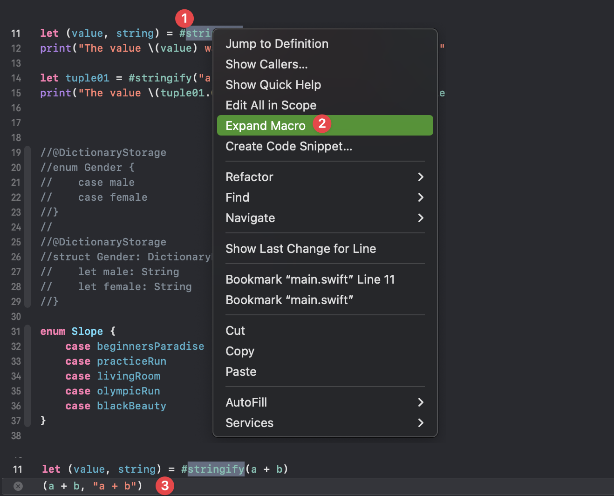
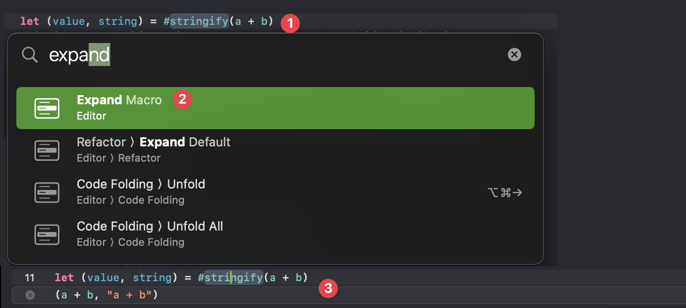
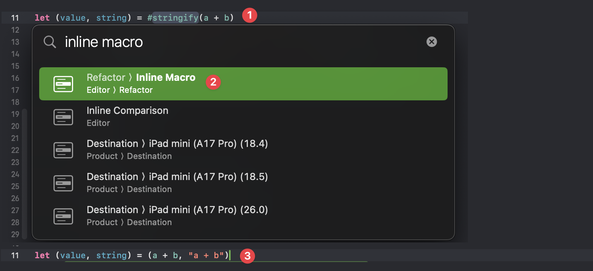
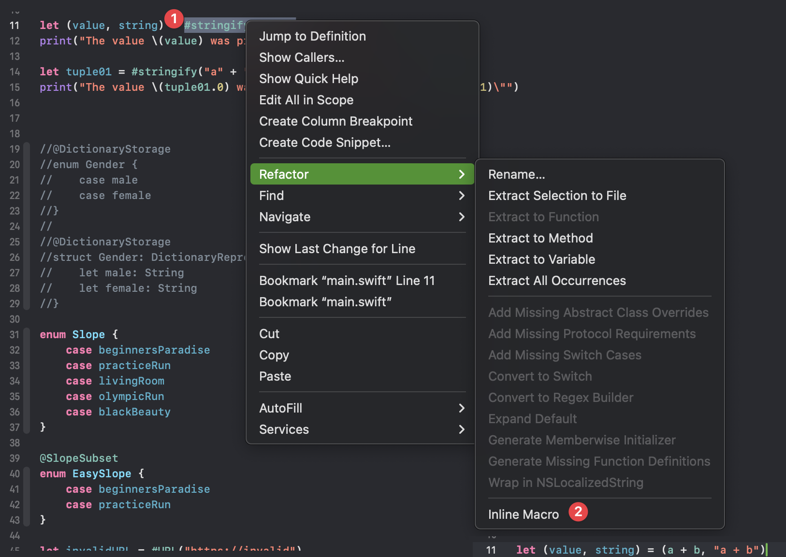

# Swift Macros
* [Documentation](https://docs.swift.org/swift-book/documentation/the-swift-programming-language/macros/)
* [hackingwithswift](https://www.hackingwithswift.com/swift/5.9/macros)
* [swiftylion](https://swiftylion.com/articles/swift-macros)
* [3rd party article](https://www.avanderlee.com/swift/macros/)

* [Apple (get source code info)](https://developer.apple.com/documentation/swift/file())

* [SwiftSyntax](https://swiftpackageindex.com/apple/swift-syntax/509.0.2/documentation/swiftsyntax)
* [SwiftSyntaxBuilder](https://github.com/apple/swift-syntax/tree/main/Sources/SwiftSyntaxBuilder)
* [SwiftSyntaxBuilder](https://swiftinit.org/docs/swift-syntax/swiftsyntax/exprsyntax)


# Macro Types
2 types of macros:
* Freestanding: begins with `#`
* Attaches: Begins with `@`

Can break/debug into macros
Can write tests for macros

# Macro Roles (You can compose multiple roles)

A good article that explains with examples [here](https://medium.com/@tahabebek/swift-macros-36417a8557a)

##  `@freestanding (expression)` 
Protocol: `ExpressionMacro`

Creates a piece of code that returns a value. 


##  `@freestanding (declaration)` 
Protocol: `DeclarationMacro`

Creates one or more declarations. 

EX: Replace a JSON String with `var prop1: String`, `var product: Product`, etc...


##  `@attached (peer)` 
Protocol: `PeerMacro`

Adds new declarations alongside the declaration it's applied to.

EX: Appends an `async` variant of of a function under a `closure` based one. 


##  `@attached (accessor)` 
Protocol: `AccessorMacro`

Adds accessors to a property

##  `@attached (memberAttribute)` 
Protocol: `MemberAttributeMacro`

Adds attributes to the declarations in the type/extension it's app

##  `@attached (member)` 
Protocol: `MemberMacro`


Adds new declarations inside the type/extension it's applied to

##  `@attached (conformance)` 
Protocol: `ConformanceMacro`

Adds contormances to the type/extension it's applied to


# Implementation
* `#externalMacro`

* Declaration goes in normal SPM module
* Implementation goes in its own `.macro` module 

* SwiftSyntax is a big part of learning. 


## Return typs
* `DeclSyntaxProtocol`


## Debugging / Breakpoints
* How to debug a macro? I want to break/inspect `DeclGroupSyntax`, `MacroExpansionContext`, etc..
  * See 19:50 in this [WWDC video](https://developer.apple.com/wwdc23/10166) 
  * You have to set a breakpoint inside the  macro expansion function, then hit that BP by running the unit test (mandatory)
  * `(lldb) po declaration`

```
EnumDeclSyntax
├─attributes: AttributeListSyntax
│ ╰─[0]: AttributeSyntax
│   ├─atSign: atSign
│   ╰─attributeName: IdentifierTypeSyntax
│     ╰─name: identifier("SlopeSubset")
├─modifiers: DeclModifierListSyntax
├─enumKeyword: keyword(SwiftSyntax.Keyword.enum)
├─name: identifier("EasySlope")
╰─memberBlock: MemberBlockSyntax
  ├─leftBrace: leftBrace
  ├─members: MemberBlockItemListSyntax
  │ ├─[0]: MemberBlockItemSyntax
  │ │ ╰─decl: EnumCaseDeclSyntax
  │ │   ├─attributes: AttributeListSyntax
  │ │   ├─modifiers: DeclModifierListSyntax
  │ │   ├─caseKeyword: keyword(SwiftSyntax.Keyword.case)
  │ │   ╰─elements: EnumCaseElementListSyntax
  │ │     ╰─[0]: EnumCaseElementSyntax
  │ │       ╰─name: identifier("beginnersParadise")
  │ ╰─[1]: MemberBlockItemSyntax
  │   ╰─decl: EnumCaseDeclSyntax
  │     ├─attributes: AttributeListSyntax
  │     ├─modifiers: DeclModifierListSyntax
  │     ├─caseKeyword: keyword(SwiftSyntax.Keyword.case)
  │     ╰─elements: EnumCaseElementListSyntax
  │       ╰─[0]: EnumCaseElementSyntax
  │         ╰─name: identifier("practiceRun")
  ╰─rightBrace: rightBrace
```
### Throwing Errors and Help
Throw errors using Diagnostic. 
context.diagnose(Diagnostic(...))


## Ideas
* completionn / async 
* Span/trace
* OSlog + remote 


## Examples
* [From WWDC](https://developer.apple.com/wwdc23/10166), we will do the ski slop example (adds an init and computed property to enums) 


## Questions
* how to pass parameters into a macro. Suppose a macro for logging a var. How to pass a message in with it?


# Xcode & Macros
`opt` + click on a macro to see documentation


## Expand Macros

Expand Macro Context Menu

<br>>

Expand Macro Quick Menu

<br>>

## Expand Macros

Inline Macro Quick Menu

<br>>

Inline Macro Refactor Menu

<br>>

# Application Ideas

## OS.logger + .localAndRemote
Perhaps a `@freestanding (declaration)`
DeclarationMacro
https://medium.com/@tahabebek/swift-macros-36417a8557a


### HatchConcurrencyMacros (Zakkro)
HatchTelemetryMacros

```swift
import Foundation

@attached(peer, names: overloaded)
public macro AddAsync(
    
) = #externalMacro(
    module: "ZakkroMacros",
    type: "AddAsyncMacro"
)
```

### HatchConcurrencyMacrosImplementation (ZakkroMacros)

```swift
/// HatchConcurrencyMacros.swift

import Foundation
import SwiftCompilerPlugin
import SwiftSyntax
import SwiftSyntaxBuilder
import SwiftSyntaxMacros

@main
struct HatchConcurrencyMacrosPlugin: CompilerPlugin {
    let providingMacros: [Macro.Type] = [
        AddAsyncMacro.self,
    ]
}


public struct AddAsyncMacro: PeerMacro {
    public static func expansion(
        of node: AttributeSyntax,
        providingPeersOf declaration: some DeclSyntaxProtocol,
        in context: some MacroExpansionContext
    ) throws -> [DeclSyntax] {
        // Inside expansion method.
        guard let functionDecl = declaration.as(FunctionDeclSyntax.self) else {
            throw AsyncError.onlyFunction // <- Error thrown here
        }
        
        let signature = functionDecl.signature.as(FunctionSignatureSyntax.self)
        let parameters = signature?.parameterClause.parameters
        let firstParameter = parameters?.first
        // ...

    }
}
```


### HatchSomeClient (ZakkroConsumer)

```swift
import HatchConcurrencyMacros
```


Use the macro
```swift
@AddAsync
func test(arg1: String, completion: (String?) -> Void) {
  
}
```

Macro Exapansion

```swift
func test(arg1: String, completion: (String?) -> Void) {
  
}

func test(arg1: String) async -> String? {
  await withCheckedContinuation { continuation in
    self.test(arg1: arg1) { object in
      continuation.resume(returning: object)
    }
  }
}
```


## AddAsync


